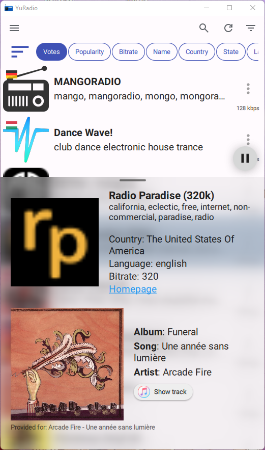

# YuRadio

A cross-platform application for playing online radio.\
Application uses RadioBrowser api (see [radiobrowser](https://api.radio-browser.info/))
and follows most of its guidelines

You can:

- Vote for your favorite radio station (cooldown after each vote is 10 minutes)
- Add the radio station to your bookmarks
- Increase the popularity of radio station by listening to it
- Search using different filters (station name, country, state, language, tags)
- Sort (votes, popularity, ...)

\

### Building

---

In order to build the project, you will need Qt6.7 with some extra dependencies
listed in the `CMakeLists.txt` files

| Option                  | Description                                                      | Default |
| :---------------------- | :--------------------------------------------------------------- | :-----: |
| `BUILD_UIOHOOK`         | Builds uiohook (enables media key support for desktop platforms) |   ON    |
| `SPOTIFY_CLIENTID`      | Spotify app client id                                            |   ---   |
| `SPOTIFY_SECRET`        | Spotify app secret                                               |   ---   |
| `SPOTIFY_CLIENTID_HASH` | Hash for app client id                                           |    0    |
| `SPOTIFY_SECRET_HASH`   | Hash for app secret                                              |    0    |

Spotify is only needed as an additional backend for displaying music information (as in [screenshot](#screenshot-light))

### Dependencies

`Qt6` `uiohook` `qtmpris`

### Supported platforms

`android` `windows` `linux`
