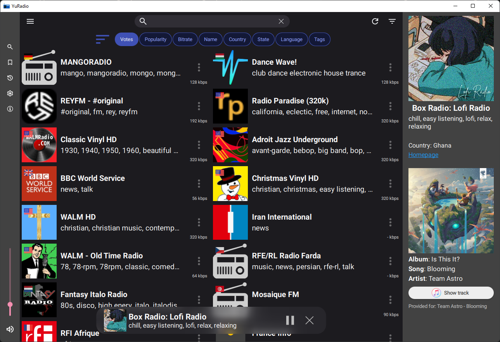

# YuRadio

A cross-platform application for playing online radio.\
Application uses RadioBrowser api (see [radiobrowser](https://api.radio-browser.info/))
and follows most of its guidelines

You can:

- Vote for your favorite radio station (cooldown after each vote is 10 minutes)
- Add the radio station to your bookmarks
- Increase the popularity of radio station by listening to it
- Search using different filters (station name, country, state, language, tags)
- Sort (votes, popularity, ...)

\

### Building

---

In order to build the project, you will need Qt6.7 with some extra dependencies
listed in the `CMakeLists.txt` files

| Option                  | Description                                                      | Default |
| :---------------------- | :--------------------------------------------------------------- | :-----: |
| `BUILD_UIOHOOK`         | Builds uiohook (enables media key support for desktop platforms) |   ON    |
| `SPOTIFY_CLIENTID`      | Spotify application client id                                    |   ---   |
| `SPOTIFY_SECRET`        | Spotify application secret                                       |   ---   |
| `SPOTIFY_CLIENTID_HASH` | Hash for application client id                                   |    0    |
| `SPOTIFY_SECRET_HASH`   | Hash for application secret                                      |    0    |

Spotify is only needed as an additional backend for displaying music information (as in [screenshot](#screenshot-light))

### Supported platforms

`android` `windows` `linux`

### Dependencies

`Qt6` `uiohook` `qtmpris`

#### Licensing

| Dependency       | License                    |
| :--------------- | :------------------------- |
| `Qt`             | LGPL, GPL                  |
| `qtmpris`        | LGPL                       |
| `uiohook`        | GPL                        |
| `Material Icons` | Apache License Version 2.0 |

#### Github Actions

| Secret                        | Description                           | Optional |
| :---------------------------- | :------------------------------------ | :------: |
| `ANDROID_KEYSTORE`            | Contents of a keystore base64 encoded | `False`  |
| `ANDROID_KEYSTORE_ALIAS`      | Keystore alias                        | `False`  |
| `ANDROID_KEYSTORE_STORE_PASS` | Keystore store password               | `False`  |
| `ANDROID_KEYSTORE_KEY_PASS`   | Keystore key password                 | `False`  |
| `SPOTIFY_CLIENTID`            | Spotify application client id         |  `True`  |
| `SPOTIFY_SECRET`              | Spotify application secret            |  `True`  |
| `SPOTIFY_CLIENTID_HASH`       | Hash for application client id        |  `True`  |
| `SPOTIFY_SECRET_HASH`         | Hash for application secret           |  `True`  |
